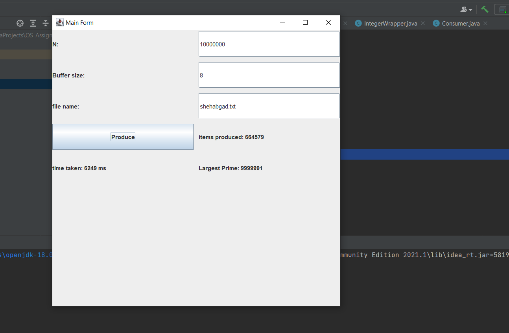

# This a multithreading application that consists of a producer that produces prime numbers from 1 to n and a consumer that writes them into a file. and both work concurrently.# 

## Input ##
1. n: is the range of prime numbers you need (1 to n)
2. buffer size: this is the buffer size that a producer produces into
3. file name: the file name that you want the consumer to write to.

## output ##
1. it writes the prime numbers from 1 to n into the file name you put in the input
2. it show the number of items produced.
3. it show the time taken for the whole process to finish in milliseconds
4. it show the largest prime number it produced.